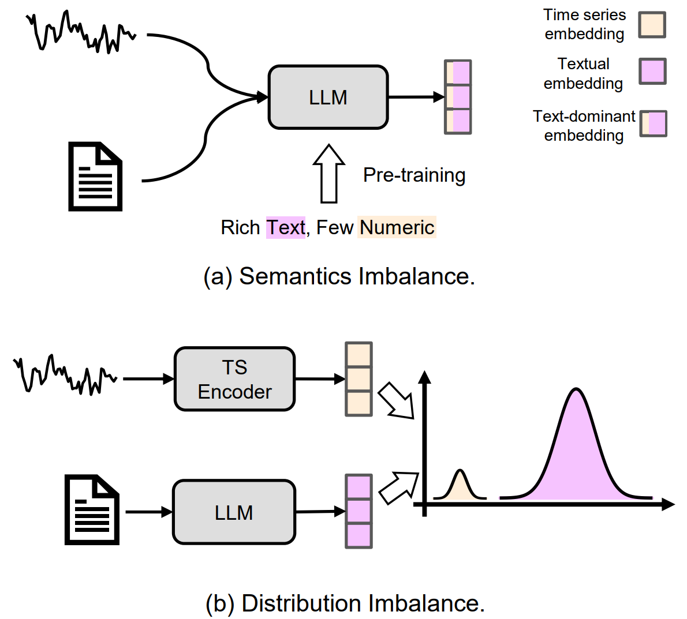
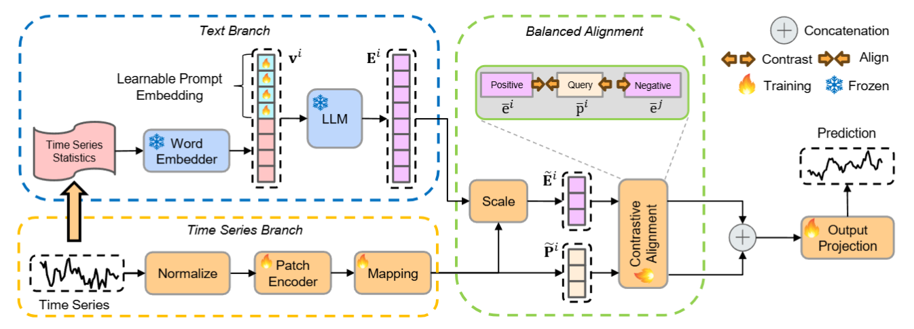
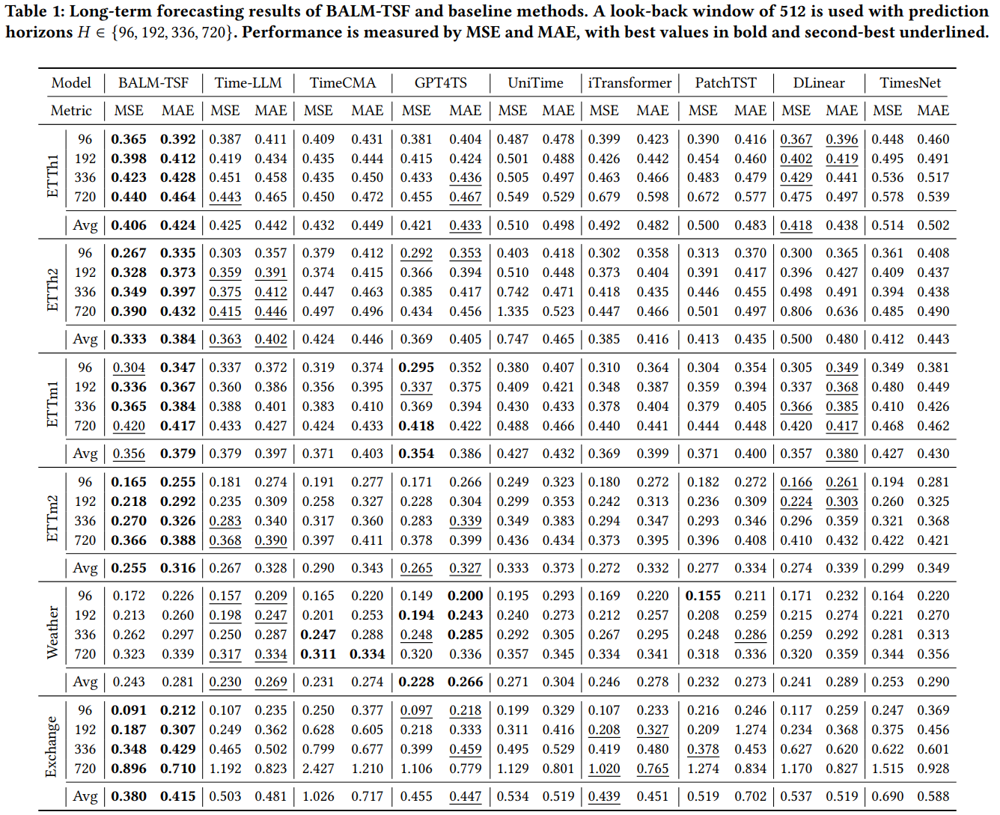

<div align="center">
  <h2><b>(CIKM 2025) BALM-TSF: Balanced Multimodal Alignment for LLM-Based Time Series Forecasting</b></h2>
</div>

## Introduction

Official PyTorch implementation of [BALM-TSF (CIKM 2025)](https://arxiv.org/abs/2509.00622).  
BALM-TSF is a lightweight framework that alleviates **modality imbalance** between text and time series 
via statistical + learnable prompts and a balanced alignment module (scaling + contrastive learning).

* Modality Imbalance:
<p align="center">

</p>

* Model Structure:
<p align="center">

</p>

## Long-term Forecasting Results

<p align="center">

</p>

## Requirements

* Python 3.11 (recommended via Miniconda)
* Install dependencies:

  ```bash
  pip install -r requirements.txt
  ```

## Datasets

Download the pre-processed datasets from [Google Drive](https://drive.google.com/file/d/1NF7VEefXCmXuWNbnNe858WvQAkJ_7wuP/view?usp=sharing), and place the extracted contents under `./dataset`. This is a public dataset sharelink from [Time-LLM](https://github.com/KimMeen/Time-LLM).

## Quick Start

1. Download and unzip datasets into `./dataset`.
2. Tune the model using the provided scripts.
3. The training and test results will be visualized and recorded via Wandb.

### Long-term Forecasting

```bash
bash ./scripts_long_term/BALM_ETTh1_GPT2.sh
```

### Few-shot Forecasting

```bash
bash ./scripts_few_shot/BALM_ETTh1_GPT2.sh
```

## Model Design

See `models/BALM.py` for implementation details.

## Citation

If you find this repository useful, please consider citing our work:

```bibtex
@article{zhou2025balmtsf,
  title={BALM-TSF: Balanced Multimodal Alignment for LLM-Based Time Series Forecasting},
  author={Zhou, Shiqiao and Schöner, Holger and Lyu, Huanbo and Fouché, Edouard and Wang, Shuo},
  journal={arXiv preprint arXiv:2509.00622},
  year={2025}
}

## Acknowledgements

We appreciate [Time-Series-Library](https://github.com/thuml/Time-Series-Library) and [Time-LLM](https://github.com/KimMeen/Time-LLM) for code references and datasets.
